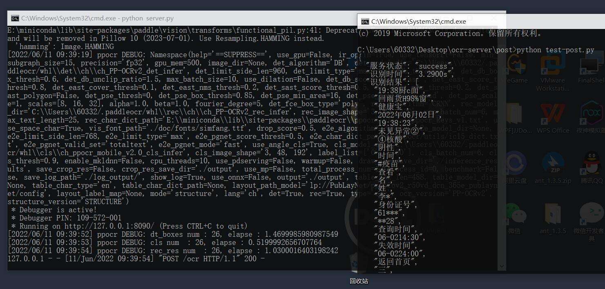
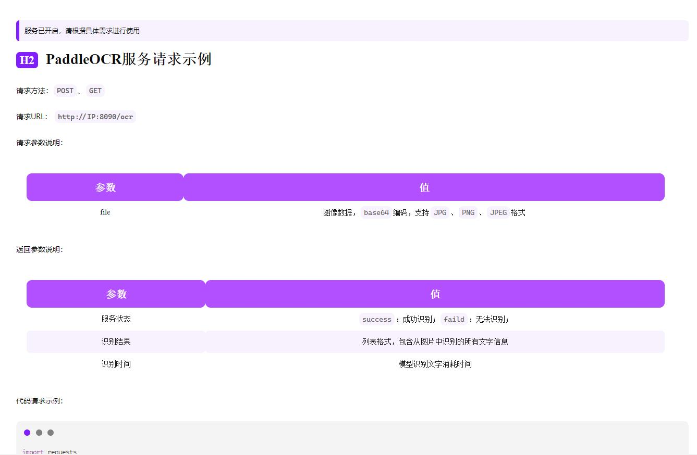

## 简介

[PaddleOCR](https://github.com/PaddlePaddle/PaddleOCR) 旨在打造一套丰富、领先、且实用的OCR工具库，助力开发者训练出更好的模型，并应用落地。Flask是一个使用 Python编写的轻量级 Web 应用框架。本项目旨在将PaddleOCR部署在Flask上，方便调用。



## 目录说明

```
- caches：上传过来识别的图片
- post
	- test-post.py：服务请求代码
	- demo.jpg：测试图片
- templates：前端界面
- server.py：server端
```

## 本地使用

1. 克隆下载本仓库代码；
2. 安装好本地需要的环境（`paddlepaddle`、`paddleocr`、以及[requirements.txt](https://github.com/PaddlePaddle/PaddleOCR/blob/release/2.5/requirements.txt)）；
3. 根据需求，修改`server.py`第97行`IP`（如果本地测试，建议`127.0.0.1`，如果云端部署，建议`0.0.0.0`）；
4. 在此文件夹下启用服务：

```
python server.py

'''
 * Debugger is active!
 * Debugger PIN: 109-572-001
 * Running on http://127.0.0.1:8090/ (Press CTRL+C to quit)
'''
```

4. 根据输出访问：`http://ip:8090/` ，如果页面可以访问，即表示服务正常启动，可以做请求；



5. 进入`post`文件夹下，修改第4行`url`为上述输出`url`，修改第5行请求的图片名称，终端运行：

```
python test-post.py

'''
{
  "服务状态": "success",
  "识别时间": "3.2900s",
  "识别结果": [
    "健康宝",
    "2022年06月02日",
    "19:38:23",
    "未见异常②",
    "④核酸",
    "阴性",
    "时间",
    "#疫苗",
    "查看",
    "名",
    "姓",
    "李*",
    "身份证号",
    "61***",
    "**28",
    "查询时间",
    "06-0214:30",
    "失效时间",
    "06-0224:00",
    "返回首页",
  ]
}
'''
```

## 云端部署

1. 修改代码`IP`；
2. 放行服务器服务端口，如：8090；

> 在一台2核2G的服务器上，服务结果可在2s内返回。

## 参数说明

- `use_angle_cls true`设置使用方向分类器识别180度旋转文字；
- `use_gpu false`设置不使用GPU；
- 单独使用检测：设置`rec`为`false`；
- 单独使用识别：设置`det`为`false`；
- paddleocr默认使用PP-OCRv3模型(`ocr_version=PP-OCRv3`)，如需使用其他版本可通过设置参数`ocr_version`，具体版本说明如下：

| 版本名称 | 版本说明                                           |
| -------- | -------------------------------------------------- |
| PP-OCRv3 | 支持中、英文检测和识别，方向分类器，支持多语种识别 |
| PP-OCRv2 | 支持中英文的检测和识别，方向分类器，多语言暂未更新 |
| PP-OCR   | 支持中、英文检测和识别，方向分类器，支持多语种识别 |

- PaddleOCR目前支持80个语种，可以通过修改`lang`参数进行切换，对于英文模型，指定`lang=en`，常用的多语言简写包括：

| 语种     | 缩写        |      | 语种     | 缩写   |      | 语种     | 缩写   |
| -------- | ----------- | ---- | -------- | ------ | ---- | -------- | ------ |
| 中文     | ch          |      | 法文     | fr     |      | 日文     | japan  |
| 英文     | en          |      | 德文     | german |      | 韩文     | korean |
| 繁体中文 | chinese_cht |      | 意大利文 | it     |      | 俄罗斯文 | ru     |

全部语种及其对应的缩写列表可查看[多语言模型教程](https://github.com/PaddlePaddle/PaddleOCR/blob/release/2.5/doc/doc_ch/multi_languages.md)

## 服务请求

请求方法：`POST`、`GET`

请求URL： `http://IP:8090/ocr`

请求参数说明：

| 参数 | 值                                                   |
| ---- | ---------------------------------------------------- |
| file | 图像数据，`base64`编码，支持`JPG`、`PNG`、`JPEG`格式 |

返回参数说明：

| 参数     | 值                                       |
| -------- | ---------------------------------------- |
| 服务状态 | `success`：成功识别；`faild`：无法识别； |
| 识别结果 | 列表格式，包含从图片中识别的所有文字信息 |
| 识别时间 | 模型识别文字消耗时间                     |

代码请求示例：

```python
import requests
import json

url = 'http://IP:8090/ocr'
files = {'file': open('./demo.jpg', 'rb')}
r = requests.post(url, files=files)
print(r.text)
```
